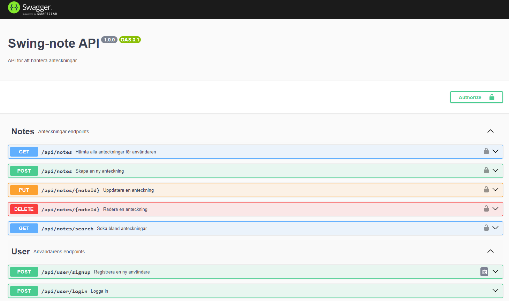

# Swing Notes API

This project aims to create a RESTful API for storing and managing notes. Users can register an account, log in, and perform various operations on notes such as creating, updating, deleting, and searching. The API utilizes JSON Web Tokens (JWT) for user authentication and authorization. Additionally, passwords are securely hashed using bcryptjs to enhance security.

## Overview

This README provides an overview of the Swing Notes API project, detailing its features, structure

## Table of Contents

- [Overview](#overview)
- [Project Structure](#project-structure)
- [Screenshots](#screenshots)
- [Dependencies](#dependencies)
- [Usage](#usage)
- [Contributing](#contributing)
- [License](#license)

## Project Structure

The project is organized as follows:

- **`/controllers`**: Contains the controllers
- **`/database`**: Contains the database files used by the application
- **`/middleware`**: Contains middleware functions
- **`/models`**: Contains the data models
- **`/routes`**: Contains the Express routes defining the endpoints of the API
- **`/services`**: Contains modules responsible for encapsulating reusable functionality or external integrations
- **`/utils`**: Contains utility functions and helper modules.
- **`/public`**: Contains publicly accessible files
- **`index.js`**: The main entry point of the application

## Screenshots

### Swagger

## Dependencies

List of main dependencies used in the project:

- express: 4.19.2
- bcryptjs: 2.4.3
- uuid: 9.0.1
- dotenv: 16.4.5
- jsonwebtoken: 9.0.2
- nedb-promise: 2.0.1
- swagger-jsdoc: 6.2.8
- swagger-ui-express: 5.0.0

## Usage

To use the Swing Notes API, follow these steps:

- Register an account using the `/api/user/signup` endpoint.
- Log in using the `/api/user/login` endpoint.
- Use the various endpoints to perform operations on notes, such as creating, updating, deleting, and searching.

## Contributing

Contributions to the Swing Notes API project are welcome!

## License

This project is licensed under the ISC License - see the [LICENSE.md](License.md) file for details.